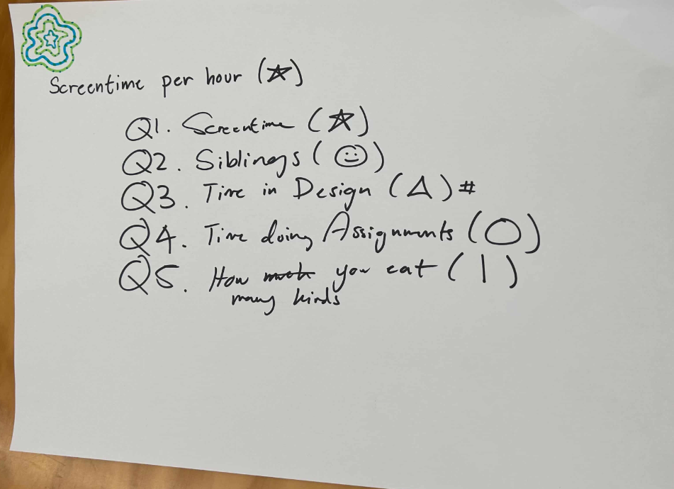
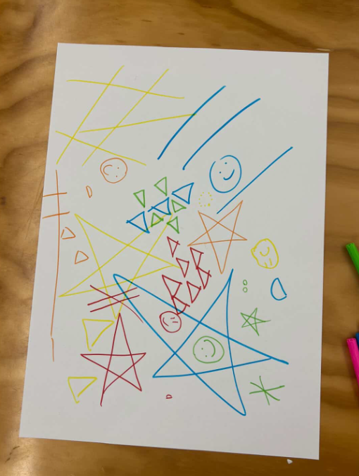
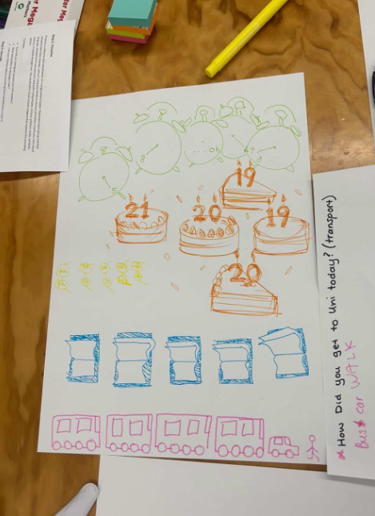
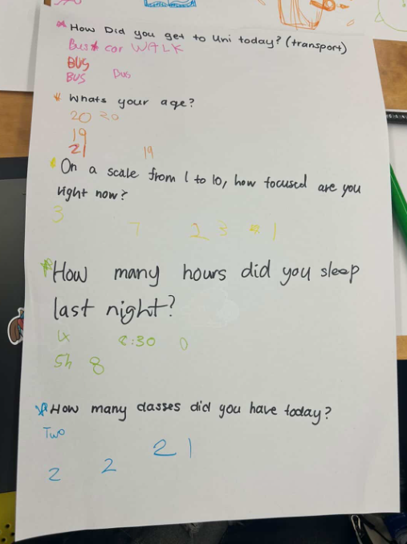

# Week 01

[← Back to Home](../index.md)

## Documentation 

## Documentation 

# Week 1 — Data Drawings

This week, we explored **data drawings** by collecting personal data in groups and translating it into a hand-drawn visualisation. The goal was to create a “group portrait” using data, and then swap with another group to see if they could interpret it.

---

## 1. Data Collection — Questionnaire

As a group, we created a **short questionnaire** to collect personal but low-stakes data from each other. The questions were designed to be a mix of playful, subjective, and everyday experiences.

*Screenshot/photo of our group questionnaire.*

Each person answered the questions anonymously on post-it notes. This made the data more about patterns and behaviours rather than identity.

---

## 2. Group Data Drawing

We then translated our answers into a **collective data drawing** using our own visual language.

*Photo of our group data drawing.*

Our group took a **very abstract and creative approach**. Instead of using obvious or literal symbols, we used shapes that were not directly related to the data. For example, we used a **star to represent screen time**, where the size of the star showed how much screen time someone had. Larger stars meant more screen time.

While this allowed for creative expression, it also made the drawing harder to interpret without explanation.

---

## 3. Decoding Another Group

We swapped our drawing with another group and attempted to decode theirs.

*Photo of another group’s data drawing.*

*Photo of another group’s questionnare.*

The other group’s approach was much more **literal and clearly connected to the data**. For example, they used a **cake with candles to represent age**, where the number of candles directly matched the person’s age. This made their drawing much easier to understand.

---

## 4. Reflection on Decoding

When another group tried to interpret our drawing, they found it **confusing and difficult to decode**. Our abstract symbols didn’t clearly relate to the data, which made it hard for them to guess what each element meant.

Because of this, we ended up giving them our **questionnaire** instead of letting them fully decode the drawing.

This highlighted how important **clarity and communication** are in data visualisation.

---

## 5. Reflection

For this exercise, we chose to track **personal and everyday data** through our questionnaire because it allowed us to capture small, human moments rather than just basic information.

Collecting the data felt quite natural, but translating it into a visual system was more challenging. Our main choice was to prioritise **creativity and abstraction**, which emphasised expression but made interpretation difficult.

One key thing I noticed is that **data visualisation needs a balance between creativity and clarity**. While abstract visuals can be interesting, they can also lose meaning if the connection to the data isn’t clear.

This relates to **data humanism** and the *Dear Data* project, where data is used to represent personal experiences in a more emotional and human way. However, in *Dear Data*, the visual language is still carefully designed so that it can be understood. Our work leaned more towards expression than communication.

The exercise also showed me that what gets included or left out depends on the choices we make. For example, we focused on **visual creativity**, but this meant we sacrificed readability.

If I were to improve this, I would:
- Make the visual language more intuitive  
- Keep creativity but add clearer connections between symbol and meaning  
- Improve the legend so others can understand it without explanation  

Overall, this activity helped me understand that data is not just numbers — it can be **personal, expressive, and interpretive**, but it also needs to be **readable to others**.

---