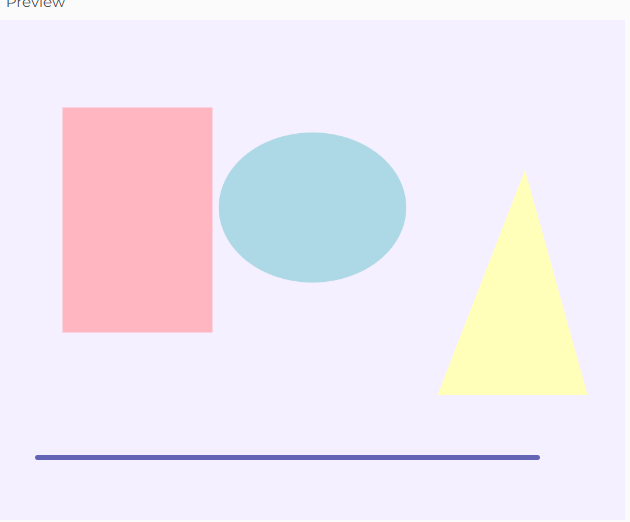
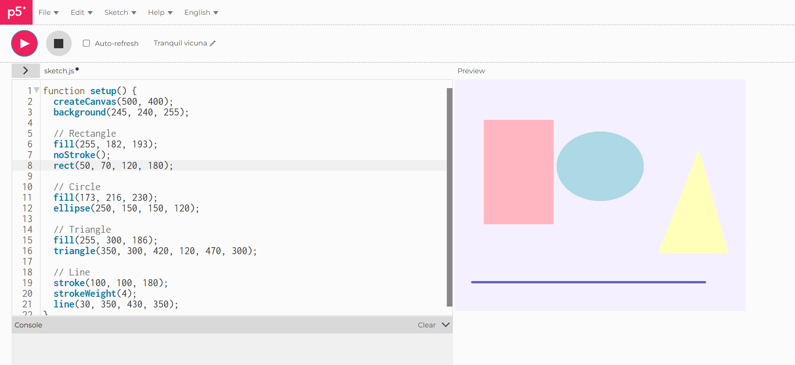
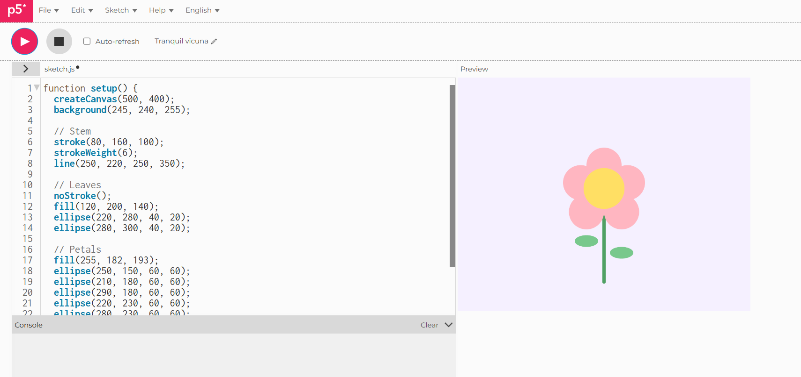
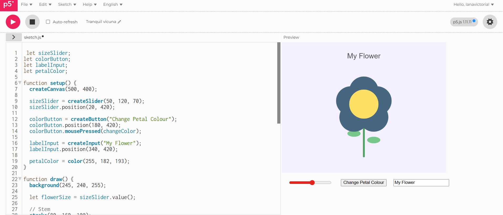
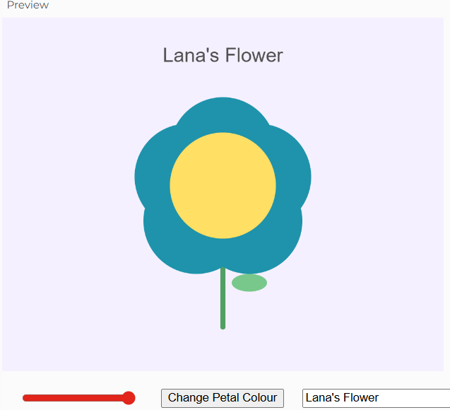
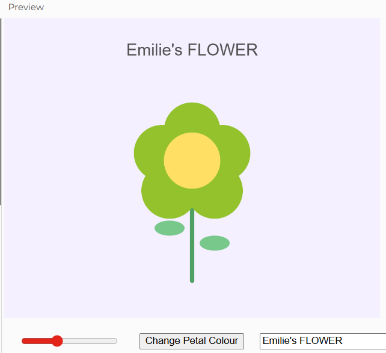
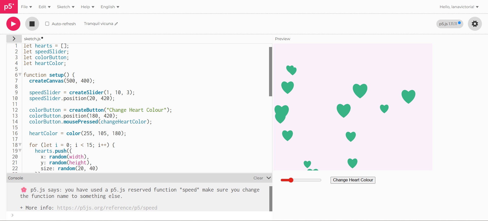
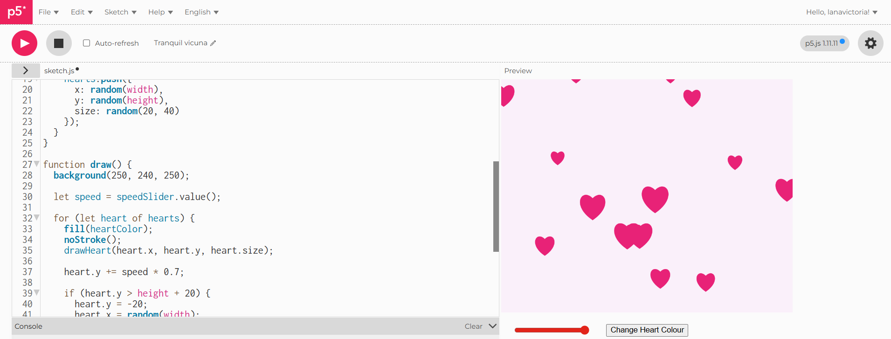
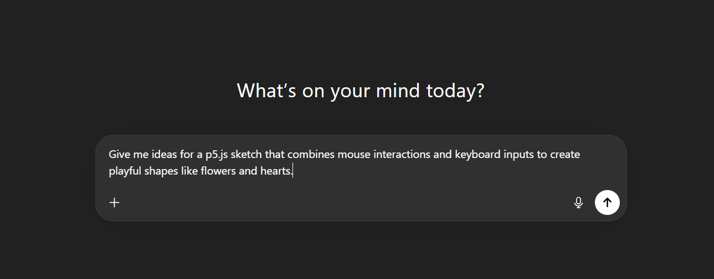

# Week 02

[← Back to Home](../index.md)

## Documentation 

# Week 2 — Interactivity

My independent study for this week focused on exploring **2D interactivity in p5.js**, building on last week’s basics with shapes and coding fundamentals. I experimented with **interactive flowers and hearts**, creating a sketch that responds to mouse clicks and key presses. I also used **ChatGPT** to help generate prompt ideas and refine the sketch logic.

---

## 1. Week 2 Sketch — Initial Shapes
I started by testing **basic shapes** using p5.js primitives like `circle()`, `ellipse()`, and `line()`. These formed the foundation for more complex interactions.

*Screenshot of the initial shapes sketch in p5.js.*

*Screenshot of the initial shapes sketch in p5.js.*

---

## 2. Interactive Flowers
Next, I added a **flower that grows wherever I click**. Each flower has multiple petals arranged in a circular pattern. Later on I kept experimenting on it! I was able to change its colors and the size of the petals through interaction with the user via a bar on the bottom which I had my friend try out!

*Screenshot of the interactive flowers appearing on canvas.*

*Screenshot of the initial shapes sketch in p5.js.*

*Screenshot of the initial shapes sketch in p5.js.*

*Screenshot of the initial shapes sketch in p5.js.*

---

## 3. Hearts
I extended the sketch by adding **hearts that go faster and can change colors!**. In this sketch, the hearts were falling from the top of the sketch and the speed of its drop was the interactive bit and could be adjusted, same to its colors. 

*Screenshot showing both flowers and hearts on the canvas.*

*Screenshot of the initial shapes sketch in p5.js.*

---

## 4. Using ChatGPT for Prompt Ideas
I used ChatGPT to **help me brainstorm ways to make the sketch interactive and visually appealing**. For example, I asked:

---

## 5. Reflection
- Interaction makes the sketch feel **alive and responsive**.  
- Combining **mouse and keyboard inputs** created a more engaging experience.  
- Using **ChatGPT** helped me **iterate faster**, but I reviewed and adapted all AI suggestions critically.  
- This sketch forms the **base for Week 3**, where I will connect live Bitcoin price data to these interactive elements.

---

## AI Usage Statement
For this week’s journal entry, I used **ChatGPT** to help brainstorm creative prompts and code ideas for my interactive sketch. I asked it for suggestions on combining mouse and keyboard input to generate flowers and hearts in p5.js. I reviewed the output critically and adapted it to fit my own design.  

### References
OpenAI. (2025). *ChatGPT* (GPT-5.3) [Large language model]. https://chatgpt.com/

