# Week 03

[← Back to Home](../index.md)
 

## Documentation 

# Week 3 — Live Data

This week, I explored **live data through both digital and analogue approaches**, focusing on weather APIs and public transport arrivals. The goal was to understand how real-time data can be accessed, interpreted, and translated into visual and material forms.

I chose to work with a **digital approach (p5.js)** alongside an **analogue protocol**, as this allowed me to compare how live data behaves across different mediums.

---

## 1. Activity 1 — Exploring Live Data with cURL

I used **cURL in the terminal** to access live data from different APIs. This helped me understand how live data is structured before visualising it.

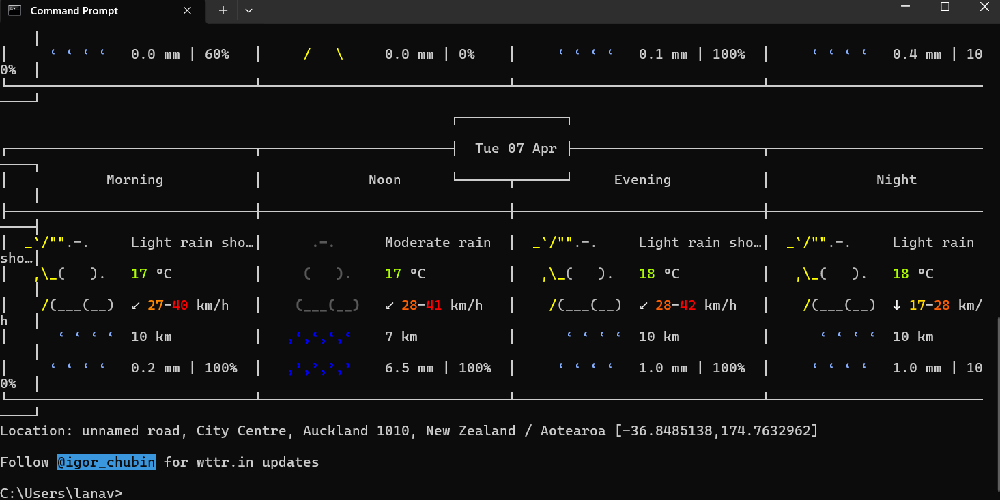
*Using cURL to retrieve live weather data for Auckland using GPS coordinates.*

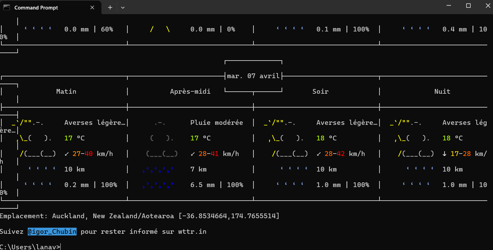
*Testing language parameters to retrieve weather data in a different language.*

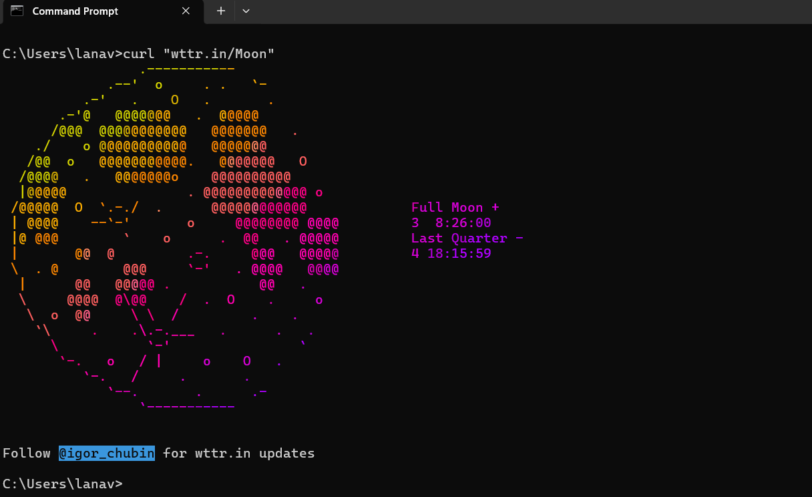
*Retrieving live moon phase data.*

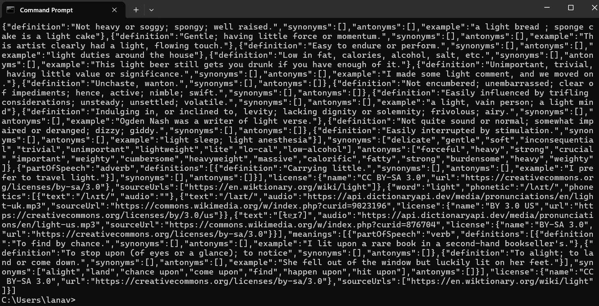
*Accessing structured JSON data from the Free Dictionary API.*

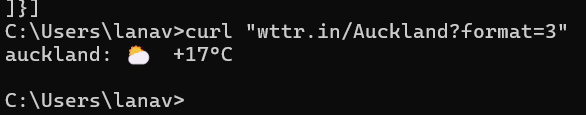
*Exploring alternative weather output formats.*

**Reflection:**  
This process helped me understand how APIs return structured data (JSON), and how this data can be filtered and used for visualisation. It also showed me that live data is constantly changing, which affects how it can be represented visually.

---

## 2. Activity 2 — Weather Visualisation in p5.js

For the digital approach, I created a **p5.js sketch using live weather data from Open-Meteo**. I mapped different data values to visual properties such as colour, size, and movement.

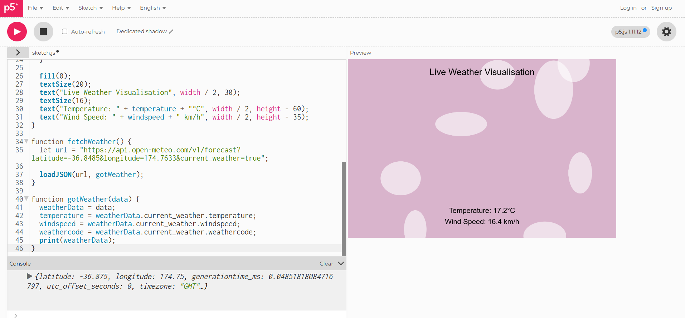
*Initial p5.js sketch visualising live weather data.*

I then changed the **latitude and longitude** to test a different location.

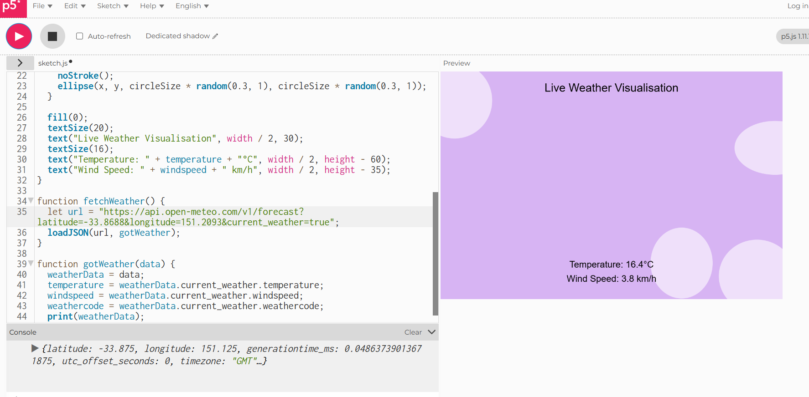
*Changing the API coordinates to another city to compare outputs.*

Next, I expanded the sketch by adding **humidity as an additional variable**, which allowed for more complex visual mapping.

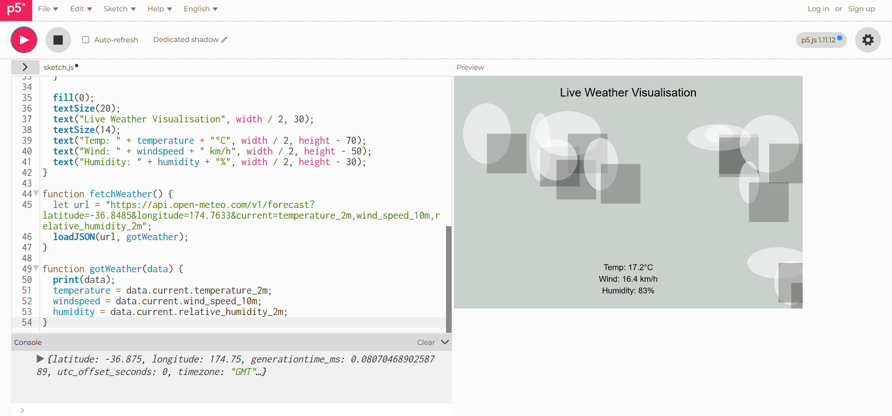
*Adding humidity to increase the complexity of the visualisation.*

I used `print()` in the console to inspect the live data values and understand their scale before mapping them.

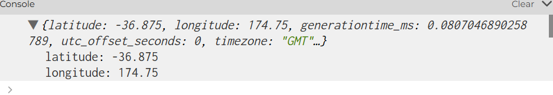
*Using print() to inspect JSON data in the console.*

Finally, I experimented with **noise()** to create smoother and more natural movement in the sketch.

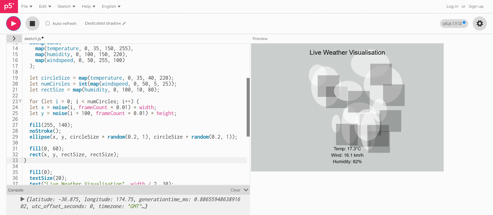
*Combining live data with noise() for smoother generative motion.*

**Reflection:**  
I decided on the mapping by connecting data values to visual properties:
- Temperature → colour and size  
- Wind speed → number of shapes  
- Humidity → background variation  

This helped me understand how data can control visual behaviour. The sketch revealed patterns in the data that numbers alone would not show, especially how changes in weather conditions affect visual density and colour over time.

---

## 3. Activity 3 — Analogue Data Protocol

For the analogue approach, I created a **data protocol based on live public transport arrivals**.

**Protocol:**
- **Source:** Live transport app  
- **Frequency:** Every 1 minute for 10 minutes  
- **Mapping:**
  - 0–2 mins → small dark circle  
  - 3–5 mins → medium grey square  
  - 6+ mins → large light triangle  
  - Delay/cancellation → zigzag line  

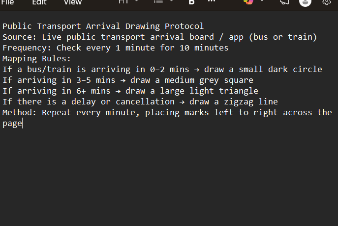
*Written data protocol instructions.*

**Reflection:**  
This process showed how **rules act like an analogue API**, translating live data into physical marks. It also highlighted how interpretation can vary depending on how clearly instructions are written. The physical outcome revealed patterns in waiting times that would be less noticeable in numerical form.

---

## 4. Reflection on Process

I used both **digital and analogue approaches** because it allowed me to compare how live data behaves across different systems.

- The **digital approach** (p5.js) was dynamic, responsive, and constantly updating.  
- The **analogue approach** was slower and cumulative, showing how data builds over time.  

The work relates to practices like:
- **Conditional Design**, through rule-based systems  
- **Nathalie Miebach**, through translating data into physical form  

Using **ChatGPT** helped me generate ideas and refine my sketch, especially when experimenting with mapping and interaction. I learned how to critically evaluate AI-generated suggestions and adapt them to my own design.

---

## 5. What I Would Develop Further

With more time, I would:
- Connect **live public transport data directly into p5.js**  
- Improve the visual complexity of the sketch  
- Explore more advanced generative techniques  
- Refine the analogue protocol and test it with other people  

---

## AI Usage Statement
For this week’s journal entry, I used **ChatGPT** to help brainstorm creative prompts and code ideas for my interactive sketch. I asked it for suggestions on combining mouse and keyboard input to generate flowers and hearts in p5.js. I reviewed the output critically and adapted it to fit my own design.  

### References
OpenAI. (2025). *ChatGPT* (GPT-5.3) [Large language model]. https://chatgpt.com/
