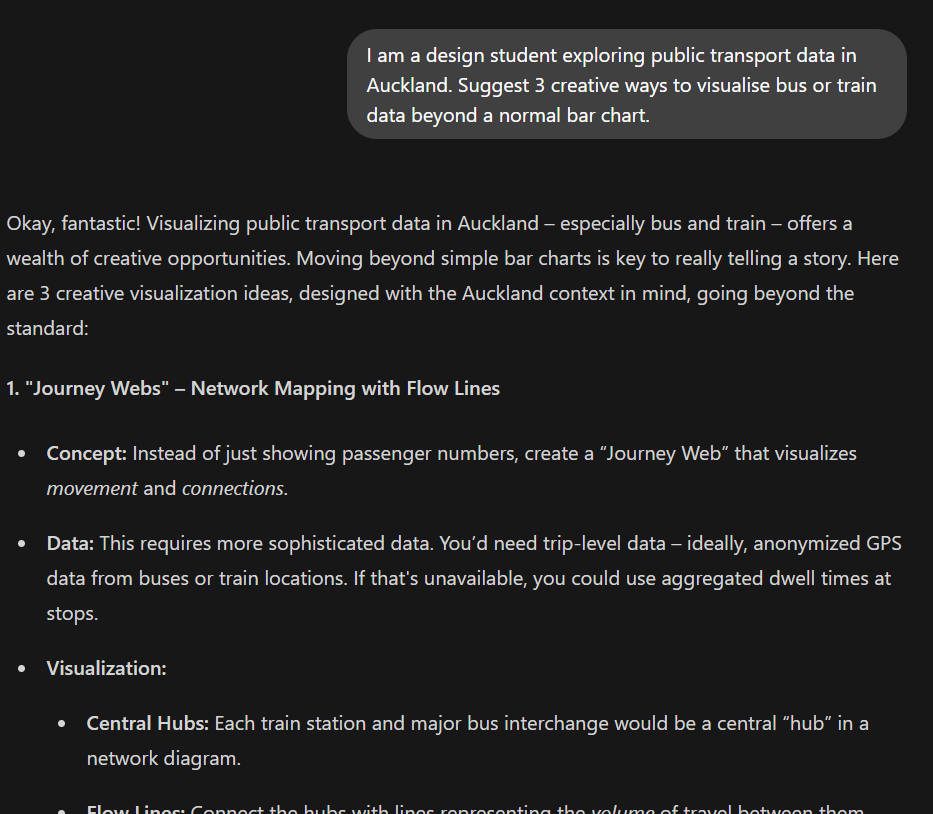
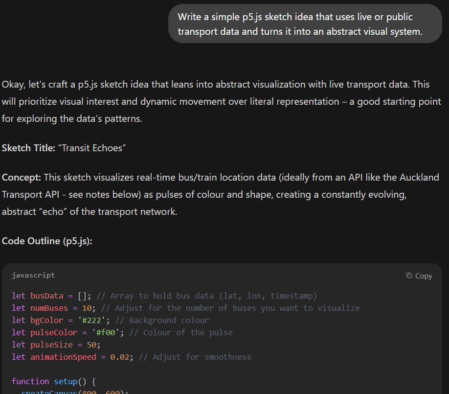
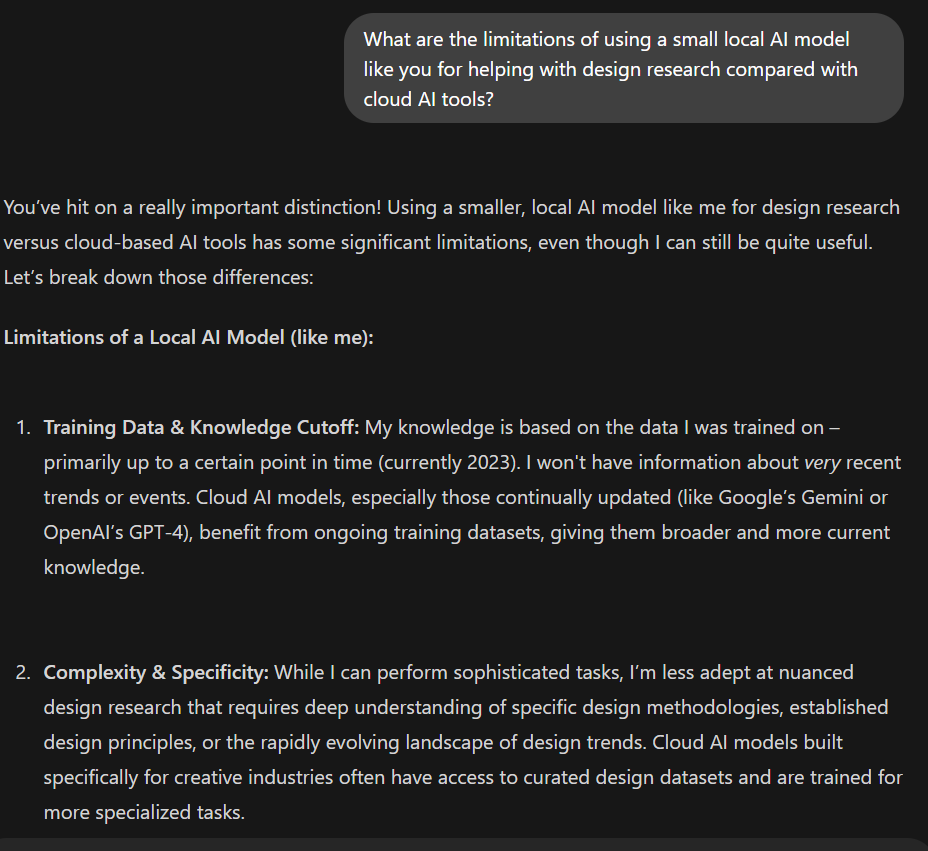
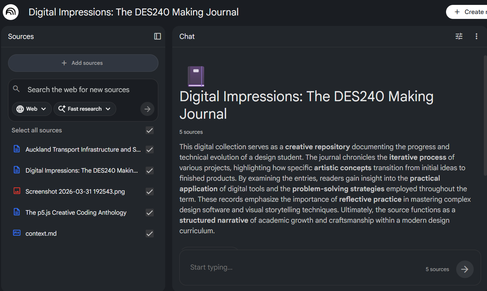
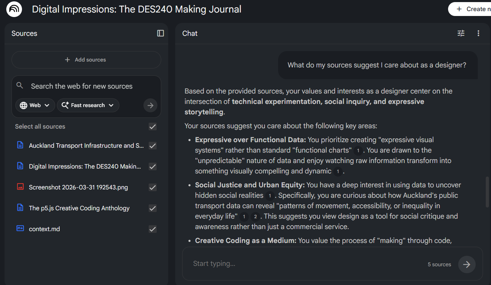
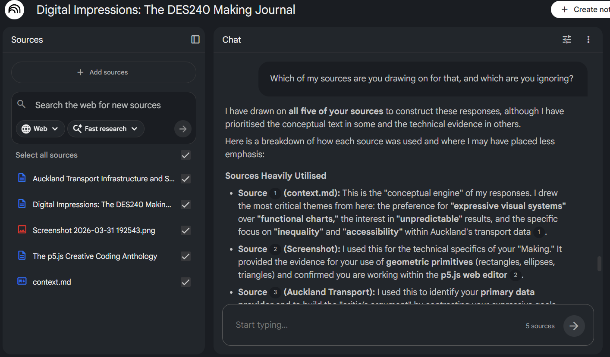
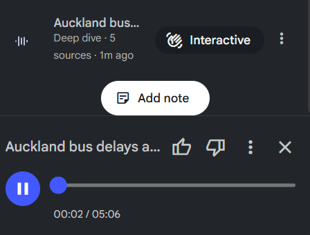
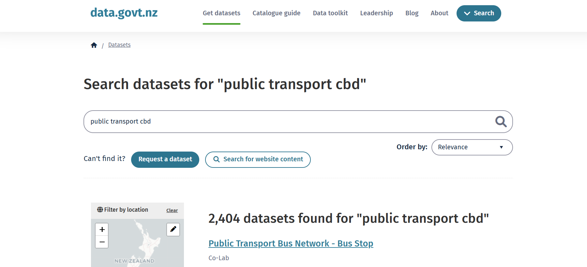
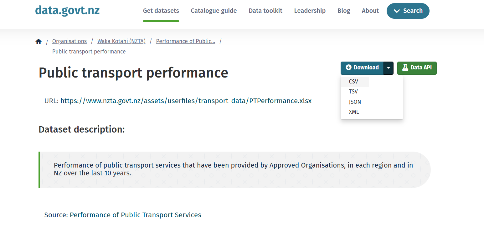
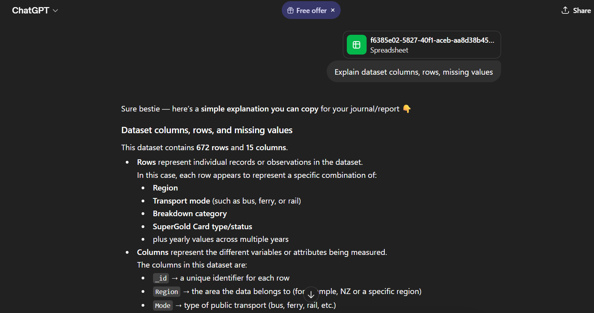

# Week 04

[← Back to Home](../index.md)

## Documentation 
# Week 4: Artificial Intelligence

My independent study for this week focused on exploring how artificial intelligence can support design research through both local and cloud based workflows. I decided to centre this around public transport data in Auckland because I am interested in how everyday systems like commuting can reveal patterns of movement, access, and inequality. This week made me think less about AI as a tool for instant answers and more as something that needs to be tested, compared, and questioned.

I started by using Ollama as a local AI model. I asked it to suggest creative ways to visualise public transport data and to propose a simple p5.js sketch idea. The responses were useful for quick brainstorming and helped me think about how transport data could become something more abstract and expressive rather than just a standard chart. At the same time, the answers felt a little more limited and generic, which made the differences between local and cloud based systems more obvious.

*Ollama suggesting creative ways to visualise Auckland public transport data.*

*Ollama proposing a simple p5.js sketch idea based on public transport data.*

I also asked the model about the limitations of small local AI systems. This was one of the most useful parts of the exercise because it highlighted the trade off between privacy and capability. Running a model locally felt interesting because it was more self contained, but it also made it clear that smaller models can struggle with deeper or more nuanced design reflection.

*Ollama reflecting on the limitations of small local AI models compared with cloud based tools.*

After that, I moved into NotebookLM and uploaded a small group of sources, including a `context.md` file that framed my interests around live data, expressive visual systems, and public transport in Auckland. I found this really helpful because it showed how much the framing of a project shapes what an AI tool gives back. Instead of just asking factual questions, I asked NotebookLM what kind of design project my sources suggested, what they implied about my interests as a designer, and what provocations were hidden in them.

*NotebookLM with my uploaded sources, including my project context and research references.*

NotebookLM was much stronger at synthesising ideas than the local model, but it also made me more aware of how selective AI can be. One of the most useful prompts was asking which sources it was drawing on and which it was ignoring, because this exposed how AI tools can prioritise some materials while overlooking others. That felt important in relation to the ethics of working with AI, especially when its outputs sound polished and confident even when they are incomplete.

*NotebookLM responding to one of my reflective prompts about my sources and design direction.*

*NotebookLM identifying which sources it was using and which it was ignoring.*

I also generated the Audio Overview, which made the ideas feel even more persuasive because they were spoken back in a confident and coherent way. This made me think about how AI is not only shaping information, but also shaping how believable that information feels depending on the format.

*NotebookLM Audio Overview generated from my uploaded sources.*

For the independent study component, I searched the Aotearoa government data catalogue for a public transport related dataset. I looked through search results and selected a dataset that could be used for future analysis and visual experimentation. This part grounded the project in something real, rather than leaving it as only a speculative AI exercise. It also reminded me that choosing a dataset is already a design decision, because it affects what stories can be told and what gets left out.

*Search results in the Aotearoa government data catalogue for public transport related datasets.*

*The selected dataset page, showing the dataset details and CSV download option.*

I then uploaded the CSV into a cloud based AI tool and asked it to explain the structure of the dataset, suggest what stories it might contain, and point out possible biases or gaps. This was helpful because it shifted the focus from simply having data to thinking critically about what the data represents, what it misses, and how it could be interpreted differently depending on the visual approach.

*Cloud based AI analysing the dataset structure, possible stories, and potential gaps or biases.*

## Reflection

This week helped me understand that AI can be useful in design, but only when it is used critically. Comparing a local model like Ollama with a cloud tool like NotebookLM made the differences in speed, depth, and confidence much more visible. The most important lesson for me was that AI is not neutral. It reflects the scale of the model, the sources it is given, and the way questions are framed.

Working with public transport data also made the exercise feel more meaningful because it connected AI to a real system that affects everyday life. Instead of seeing data as something purely technical, I started to think about how it can reveal questions of access, inequality, and visibility. Overall, this week expanded my understanding of AI as both a creative tool and something that needs to be questioned at every stage of the design process.

## AI Usage Statement

For this week’s experiment, I used a combination of local and cloud based AI tools as part of my design research and reflection process. I used Ollama with the Qwen3:1.7b model to test a local AI workflow, asking it for creative visualisation ideas, a simple p5.js sketch concept, and reflections on the limitations of small local models compared with cloud based systems. I then used NotebookLM to upload a small set of sources, including a custom `context.md` file and project related references, and asked it reflective questions about my design direction, values, and the possible provocations hidden within my source material. I also used NotebookLM’s Audio Overview feature to compare how AI generated summaries change when presented in spoken form. Finally, I used ChatGPT to help structure and edit my weekly blog entry based on my completed activities, screenshots, and notes. All AI outputs were reviewed, selected, and rewritten critically as part of my own design reflection.

## References

Google. (2024). *NotebookLM* [Large language model]. https://notebooklm.google/

OpenAI. (2025). *ChatGPT* (GPT-5.3) [Large language model]. https://chatgpt.com/

Ollama. (2025). *Ollama* (running Qwen3:1.7b locally) [Large language model platform]. https://ollama.com/

Alibaba Cloud. (2025). *Qwen3:1.7b* [Large language model]. https://qwenlm.github.io/
