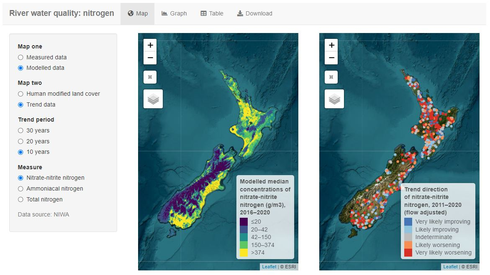
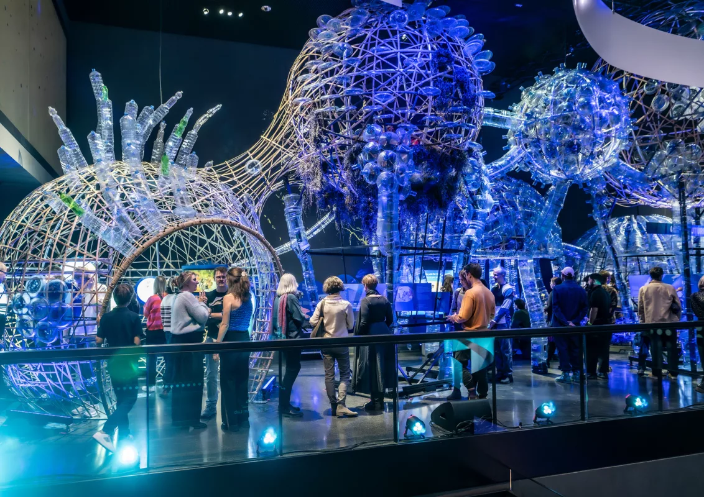
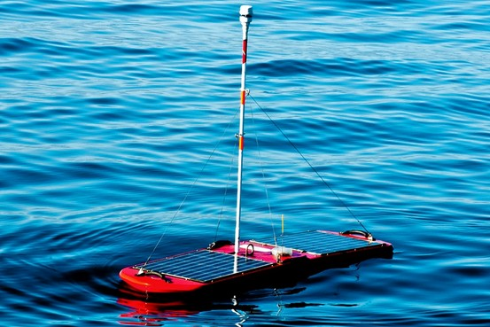
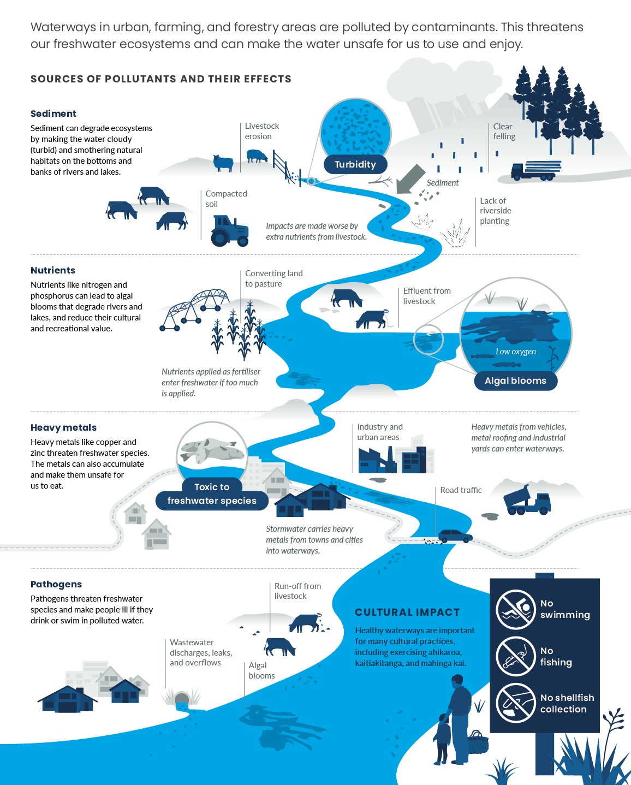

# Week 06

[← Back to Home](../index.md)

## Documentation 

# Week 06 Blog  

# In-Class Activities  

## 1. Data Exploration  

For this activity, I explored water quality datasets connected to Auckland’s marine and coastal environments. The information mainly came from Auckland Council environmental monitoring reports and Knowledge Auckland databases, which collect long-term data about coastal and estuarine water quality around the region. The dataset included monitoring areas such as the Waitematā Harbour, Manukau Harbour, Kaipara Harbour, and the Hauraki Gulf.  

The data was organised by monitoring locations and different water quality measurements. These included pH levels, salinity, turbidity, nitrate levels, suspended sediment, water clarity, and bacteria levels. Data was collected regularly across different sites over multiple years, making it possible to compare patterns and changes in water quality over time. Some reports also used Water Quality Index rankings to show the overall condition of each location.  

While exploring the dataset, I noticed a few limitations and gaps. Some locations had more detailed monitoring than others, which could make comparisons less accurate. Certain reports focused mainly on coastal water quality and did not include all freshwater systems or faecal contamination information. Weather events like storms or heavy rainfall could also affect results temporarily, meaning some data may not fully represent long-term conditions. Another limitation was that some areas were only monitored monthly, so smaller pollution events may not have been recorded.  

Overall, the dataset was useful because it provided real environmental data collected over a long period of time. It helped me better understand how Auckland’s marine environments are monitored and how water quality can vary between different coastal areas. The data also showed the importance of environmental monitoring for public awareness and protecting marine ecosystems.  

## 2. Visual Research and Precedent Study  

### Reference 1  

`dick` 

I was drawn to this because of the way it presents environmental information clearly through data visualisation. The use of interactive visuals makes complex information easier to understand for audiences. This reference reinforced my idea of making environmental data more engaging and accessible through interactive design.  

### Reference 2  
 

I liked the way Live Ocean combines scientific information with visually engaging graphics and real-time environmental monitoring. The website made me think more about how environmental data can feel dynamic rather than static. This inspired me to consider adding interaction or movement into my own project through p5.js.  

### Reference 3  

`Balangay Spacecraft Installation` 

I liked the exhibition-style presentation and the speculative approach to future environmental conditions. It gave me ideas about how my own project could become more immersive and experiential rather than simply displaying numbers or graphs. This reference encouraged me to think about storytelling and audience experience within my project.  

### Reference 4  

`Wave Glider` 

The wave glider stood out to me because it collects and displays environmental data in real time through its built-in design. This was one of my first inspirations for the project because originally I wanted my artefact to measure data itself. Although my project direction shifted more towards displaying existing data, this reference still influenced the visual and conceptual direction of my work.  

### Reference 5  

`dick`  

I liked how this visual communicates environmental pollution through a strong visual hierarchy and simplified information. It showed me how environmental issues can be communicated visually without overwhelming the viewer with too much technical detail. This reinforced my interest in creating a design that balances aesthetics and information.  

## 3. Project Planning and Skills Roadmap  

### 3.1 What do I need to make?  

[Insert image of concept sketch/poster design]  

My project idea is an interactive or visual artefact that communicates the safety and risks of water quality in relation to fishing in Aotearoa. I want the final outcome to either exist digitally through p5.js or as a designed 2D/3D poster installation. The project will visually represent different levels of water safety and environmental risk using abstract forms, fish-inspired visuals, colour changes, and interactive elements. Users may be able to click or interact with shapes to reveal different environmental data and safety information connected to different water areas.  

### 3.2 What do I need to learn?  

1. Understanding p5.js coding and interaction  
2. Graphic design and visual communication  
3. Mapping environmental data to visual outputs  
4. Organising and simplifying data patterns  
5. Sketching and prototyping concepts digitally  

### 3.3 What are my next steps?  

The next step for my project is to continue experimenting with p5.js and test whether my ideas are feasible and interactive for an audience. I also need to organise and simplify the environmental datasets I have collected so I can create a clearer overall understanding of water safety in relation to fishing across different areas in Aotearoa. Since I am still unfamiliar with coding and creating interactive digital work, I want to improve my technical skills so I can build visuals that better match my intended design outcomes.  

Because my project direction is abstract and visually experimental, I think one of the biggest challenges will be translating environmental data into shapes and interactions that are still meaningful and understandable. I also want to continue refining the visual style of the project so that it feels engaging rather than overly scientific or data-heavy. My next experiments will focus on interaction design, colour systems, animation, and testing how fish-inspired forms can represent different environmental conditions and levels of safety.  

# Independent Study  

## 1. Consultation Reflection  

During the feedback consultation with Leo, I realised that I may have misunderstood part of the project brief. Originally, I wanted to create an artefact that could physically measure environmental data itself rather than visualise existing datasets. Through the discussion, it became clearer that the focus of the assignment was more about designing a data-driven visualisation rather than building a scientific measuring device. Even though this changed my direction slightly, it also helped me focus my ideas more realistically.  

The consultation reinforced my interest in using p5.js because it was one of the experiments from earlier weeks that stood out to me the most. Instead of collecting new data, I decided I could work with existing environmental datasets and use interaction and visual design to communicate information about water quality and fishing safety. The discussion also encouraged me to think more carefully about how audiences would engage with the project visually and conceptually. As a result, I now plan to focus more on interactive digital experimentation, environmental storytelling, and translating water quality data into abstract visual forms.  

## 2. Technical Skill Building  

For this technical experiment, I focused on improving my understanding of p5.js and interactive coding. Since this was my highest-rated skill area from previous experiments, I wanted to explore how it could connect directly to my project idea. I used ChatGPT to help generate different p5.js sketches related to environmental and fishing safety data.  

My first experiment involved asking ChatGPT to generate a p5.js visualisation showing percentages of risk connected to different water types in Aotearoa. Although the outcome was interesting, I realised the results were not entirely accurate because I had not clearly specified what kind of environmental risk I wanted to represent. This taught me the importance of giving clearer prompts and understanding the datasets before visualising them.  

For my second experiment, I asked ChatGPT to create a fish-shaped interactive visual based on my water quality research. The interaction allowed the fish to change visually when clicked, representing different safety levels and environmental conditions. Even though some of the generated information was not requested, it still gave me useful ideas for how interactivity and visual storytelling could work within my project.  

My final experiment attempted to replicate the overall direction of my proposed artefact through p5.js. The generated outcome was closer to what I imagined conceptually, although it would still require significant adjustments and refinements. Overall, these experiments helped me better understand the possibilities and limitations of p5.js while also giving me clearer ideas about how to move forward with my project.  

[Insert screenshots/code experiments]  

## 3. Initial Concept Sketch  

[Insert poster sketch or digital prototype]  

For my initial concept sketch, I experimented with designing a poster-style visualisation that communicates water quality and fishing safety information through abstract environmental graphics. I wanted the design to feel visually engaging while still presenting important environmental data. Instead of focusing only on charts or graphs, I explored using fish-inspired shapes, colour systems, and layered visuals to represent different levels of environmental safety and pollution.  

The sketch helped me visualise how my final artefact could combine environmental awareness with interactive or speculative design approaches. While the concept is still developing, creating this initial prototype allowed me to better understand the visual direction I want to continue exploring in future experiments.  

# References  

Knowledge Auckland. (2016). *Marine water quality state and trends in the Auckland region from 2007–2016*. Auckland Council. https://knowledgeauckland.org.nz/publications/marine-water-quality-state-and-trends-in-the-auckland-region-from-2007-to-2016/  

Knowledge Auckland. (2019). *Coastal and estuarine water quality 2019 annual data report*. Auckland Council. https://knowledgeauckland.org.nz/publications/coastal-and-estuarine-water-quality-2019-annual-data-report/  

Knowledge Auckland. (2022). *Coastal and estuarine water quality in Tāmaki Makaurau Auckland 2021–2022 annual data report*. Auckland Council. https://knowledgeauckland.org.nz/publications/coastal-and-estuarine-water-quality-in-tamaki-makaurau-auckland-2021-2022-annual-data-report/  

Auckland Council. (n.d.). *Understanding Auckland’s freshwater*. https://www.aucklandcouncil.govt.nz/environment/looking-after-aucklands-water/water-strategy-policy-standards/freshwater-management-policy-standards/implementing-national-policy-statement-freshwater-management-auckland/understanding-aucklands-freshwater.html  

Department of Conservation. (n.d.). *Tāwharanui Marine Reserve: Water quality*. https://www.doc.govt.nz/nature/habitats/marine/type-1-marine-protected-areas-marine-reserves/marine-reserve-report-cards/tawharanui-marine-reserve/water-quality/  

OpenAI. (2025). *ChatGPT (GPT-5.5)* [Large language model]. https://chatgpt.com/  

https://pce.parliament.nz/publications/submission-on-stats-nz-s-retirement-of-interactive-data-visualisations/  

https://liveocean.org/  

https://futurium.de/en/ocean-futures  

https://s.wsj.net/public/resources/images/RV-AG214_FINN_G_20120309022707.jpg  

https://environment.govt.nz/assets/facts-and-science/environmental-reporting/OFW2019_Pollution__FitWzEyMDAsMTQ5M10.jpg  
## Images & Media

*Use the format below to embed images from your assets folder:*

``
`*Your caption here*`

*The text inside the square brackets is alt text (a description for accessibility), not a visible caption. To add a caption, place a line of italic text below the image.*

## AI Usage Statement  

For this project, I used OpenAI’s ChatGPT (GPT-5.5) as a support tool during my research, writing, and technical experimentation process. I used ChatGPT to help summarise and organise information from environmental datasets and to assist with generating and refining written reflections for my weekly blog documentation.  

I also used ChatGPT during technical experimentation with p5.js coding. I prompted the AI to generate interactive p5.js sketches related to environmental data visualisation, including experiments involving fish-inspired visuals, colour interaction, and water safety data representation. These generated outputs were used as starting points for experimentation and idea development rather than final completed outcomes.  

