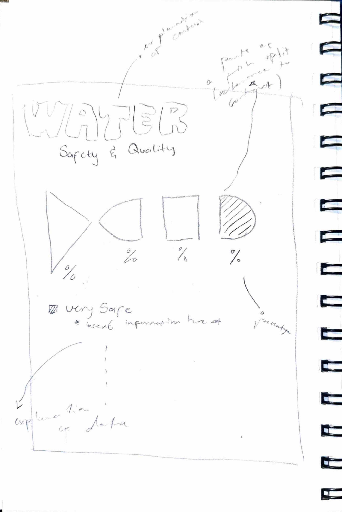
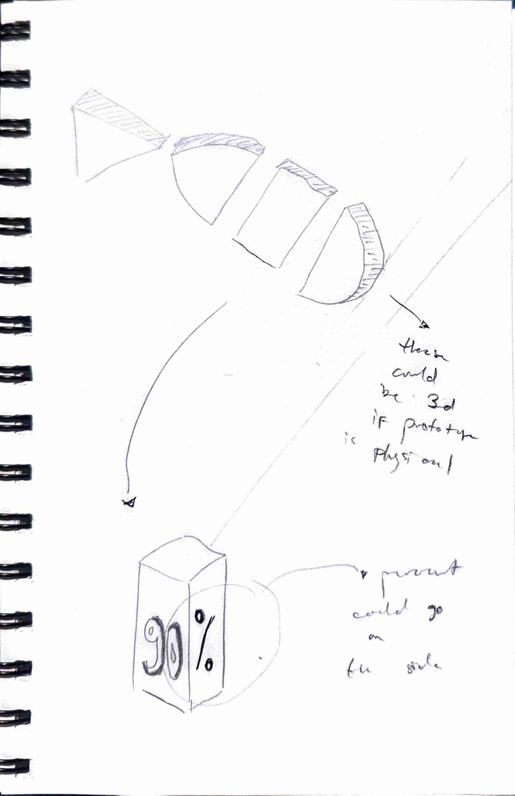
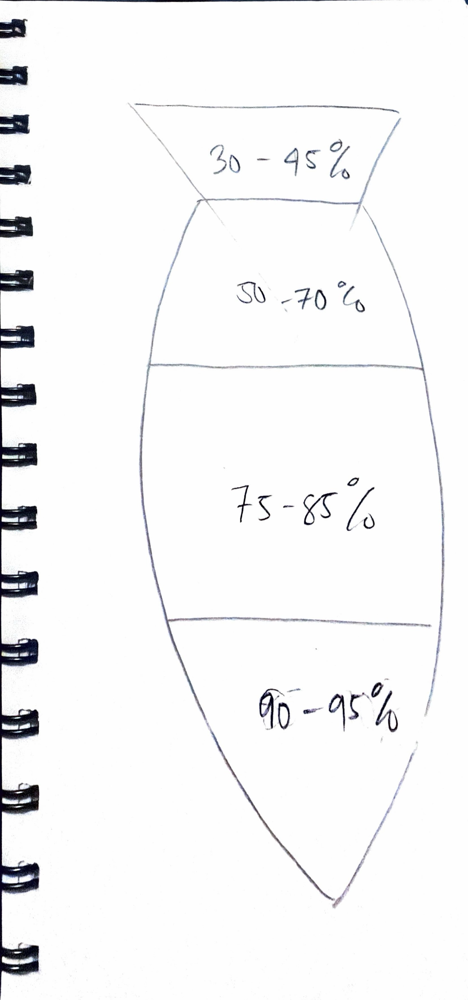
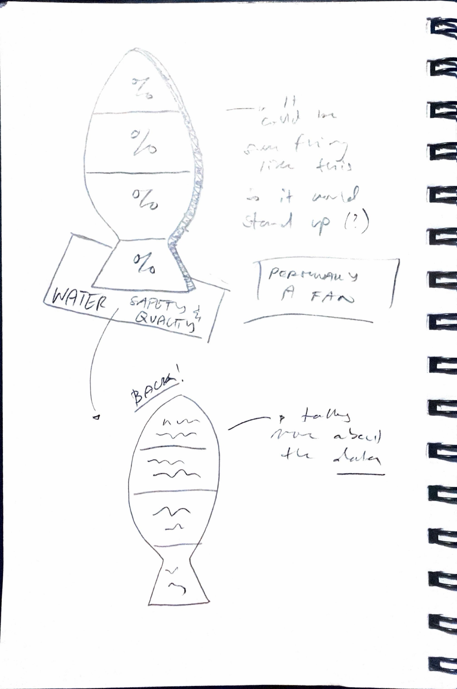
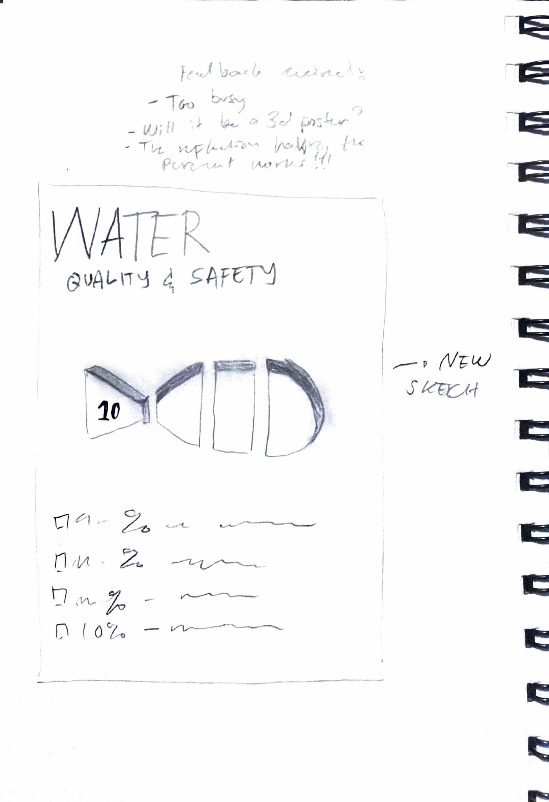

# Week 07

[← Back to Home](../index.md)

## Documentation 

# Week 7

## In-Class Activities

### Concept Sketches

This week I further developed my concept sketch by adding more detail about where my datasets would go and how I could visually present the information through a 2D outcome.

*Further Concept Sketch* 

After showing my sketch to classmates, I received feedback that helped me rethink the project. A lot of people asked whether it was meant to be a poster and questioned how viewers would understand the different colours and percentages. Some also felt that the design was too busy and had too much information competing for attention.

This feedback made me realise that I could explore presenting the project through physical materials instead of only a poster. I started considering materials such as wood and glass, although I would need to make sure the colours remained visible and easy to differentiate if I used transparent materials.

After receiving feedback, I created another sketch where I made the fish shape more three-dimensional. I wanted the fish to become the most visually dominant element because it represents the main focus of my project.

*Dissecting my Sketch* 

For a short time I also explored a different concept. I drew a fish divided into four sections, with each section representing a different percentage of water safety. Although these percentages were inspired by real environmental data, they were only estimates and not official figures. This helped me think about how data could be translated into visual forms and patterns.

Last week I mentioned that I wanted to focus on learning how to organise patterns from datasets more effectively. I want to continue developing this skill so I can ensure my data visualisations remain as accurate and understandable as possible.

### Making Sprint

For the Making Sprint, I focused on developing further sketches and visual explorations of my concept. I produced a range of annotated drawings to investigate different forms, functions, and interactions, helping me better understand how the design could operate within an underwater environment.

Some sketches explored the overall appearance and biomimetic qualities of the concept, while others focused on technical features such as sensors, cameras, and methods of environmental data collection. Through this process, I was able to refine my ideas and communicate them more clearly.

Creating multiple iterations helped me identify strengths and weaknesses within the concept, respond to feedback, and further develop how the design could function both practically and speculatively.

*First Sketch* 

### What If Variations

After discussing my work with a classmate, I received three "What If" suggestions:

- What if this was made using materials connected to water?
- What if this became a double-sided framed piece?
- What if this was made from thick card or board so it could stand by itself?

I found the freestanding idea particularly interesting because it could make the project more physical and interactive while still presenting the data visually.

*Dissecting my Sketch* 

These ideas encouraged me to move beyond a traditional poster format and consider how my project could occupy physical space. I started thinking about ways to transform the original flat design into something more three-dimensional.

---

## Independent Study

After completing the What If activities, I became more interested in creating an outcome that people could view from different angles. By spreading information across multiple surfaces, I could potentially reduce visual clutter and create a more engaging experience.

I began experimenting with ways of introducing three-dimensional elements into my designs, whether through layered poster structures or a completely physical object.

*Sketch after Feedback from classmates* 

While creating posters and testing simple 3D forms, I realised that working in three dimensions takes practice. At first it was difficult to understand how the forms would work together, but after several attempts I became more comfortable with the process.

These experiments helped me think about how environmental data could become something more interactive and spatial rather than simply existing as a flat infographic.

---

## Progress Report Preparation

Instead of focusing on presentation slides, I used this stage to document and reflect on the development of my project through sketches, concept iterations, and draft poster designs.

Most of my progress was communicated visually through annotated sketches, which allowed me to explore different forms, functions, and interactions for the concept. Alongside these sketches, I also developed several versions of my draft poster to refine how the project and its ideas were being communicated.

Reviewing these sketches and poster iterations helped me identify areas for improvement, respond to feedback, and further develop both the concept and its visual communication.

### Feedback Questions

1. Does the fish shape help communicate the environmental data, or does it distract from the information?

2. Would a three-dimensional outcome be more engaging than a traditional poster format?

3. How can I make the different water quality percentages easier to understand while maintaining visual interest?

---

## Reflection

This week helped me understand the importance of testing ideas early and gathering feedback from others. The comments I received highlighted issues that I had not considered, especially around clarity and visual complexity.

The What If activity encouraged me to think beyond my original poster-based approach and begin exploring physical forms and structures. Moving forward, I want to continue experimenting with graphic and three-dimensional approaches while focusing on communicating environmental data clearly and effectively.

