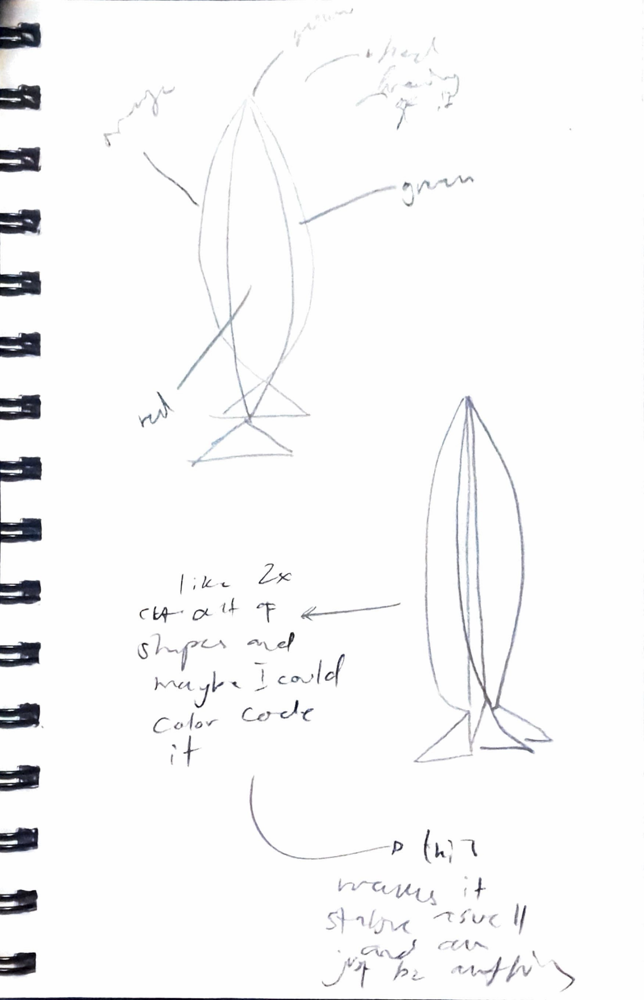

# Week 08

[← Back to Home](../index.md)

## Documentation 

# Week 8

## In-Class Activities

### Progress Report

Unfortunately, I was unable to attend class this week, so I asked several friends from class to review my progress report and provide feedback.

The most common feedback I received was that my project still seemed undecided. Several people mentioned that I need to begin finalising my direction soon so that I have enough time to properly develop and refine the outcome.

One of the biggest challenges I discussed in my presentation was deciding whether I wanted the project to remain graphic design focused or become a more physical outcome. At the moment, I am still interested in creating something graphic design based, but I am struggling to find ways to make a poster interactive without simply turning it into a three-dimensional object.

My classmates also provided technical advice. One suggestion was to create simple prototypes using thick materials such as cardboard or boxes first before committing to a final design direction. This would allow me to quickly test ideas and understand whether the physical interaction adds value to the project.

Another concern I brought up was that I felt my poster contained too much information. Surprisingly, most of my classmates disagreed. They felt that the amount of information was appropriate and that the most important thing was making sure the data remained accurate and easy to understand.

### Key Feedback Themes

- Finalise the project direction.
- Continue testing physical and graphic design outcomes.
- Focus on creating meaningful interaction.
- Keep the environmental data accurate and understandable.
- Don't remove information unless it affects readability.

---

## Critical Design Propositions

Since I was unable to participate in the in-class activity, I reflected independently on alternative directions my project could take.

One question I asked myself was:

**What if the audience could physically reveal information rather than simply viewing it?**

This made me think about interaction in a much simpler way. Rather than relying on technology, I could create an experience where viewers flip, rotate, unfold, or reveal information through physical interaction.

*Sketch of my New Artifact Direction* 

Some alternative directions I considered included:

- Folding information panels.
- Double-sided information displays.
- Rotating fish forms that reveal different environmental conditions.
- Layered information hidden beneath other layers.

These ideas felt more engaging while still keeping the focus on the environmental data.

## Independent Study

### Fusion Research and 3D Modelling Exploration

For my independent study, I focused on researching and learning Autodesk Fusion to help visualise my concepts in three dimensions.

Tutorials Used

1. Autodesk Fusion 360 Tutorial for Beginners | Learn 3D Design Step by Step

2. Fusion 360 Complete Beginner Tutorial | Sketch to Manufacturing

3. Fusion 360 Tutorial for Absolute Beginners – Introduction (2020)

4. Product Design Online – Fusion 360 for Beginners Series

At this stage, many of my ideas existed primarily as sketches, and I wanted to explore how they might translate into a more realistic form. Rather than immediately building physical prototypes, I decided to investigate 3D modelling workflows and learn the fundamentals of Fusion.

Through tutorials, experimentation, and practice exercises, I began developing an understanding of modelling tools, forms, and workflows that could later support the development of my concept.

I was particularly interested in how Fusion could help me communicate the structure and functionality of my speculative underwater design more clearly than sketches alone.

Although I was still in the early stages of learning the software, this research provided a foundation for future modelling and prototyping work.

### Research and Skill Development

This week I focused on:

* Learning the basics of Autodesk Fusion.
* Researching 3D modelling workflows and techniques.
* Exploring how my sketches could be translated into digital models.
* Developing forms inspired by deep-sea organisms and biomimicry.
* Investigating how emerging technologies could be integrated into the concept.

This research helped me better understand the next steps required to move my project from concept sketches towards more detailed visualisations and potential prototypes.

### Research Notes

Through my research, I investigated water quality conditions across different types of waterways in Aotearoa New Zealand to better understand which environments are generally safer for fishing and ecological health.

Rather than focusing only on individual locations, I analysed broader categories of water environments including mountain lakes and alpine rivers, coastal marine areas, lowland lakes and rural rivers, and urban streams, ponds, and estuaries. By comparing national environmental reports and water quality monitoring data, I identified clear patterns in how pollution, land use, and water circulation influence environmental conditions.

My findings suggested that mountain lakes and alpine rivers are generally the safest environments, with approximately 85–90% of monitored sites showing good water quality due to limited human impact. Coastal marine areas and beaches followed closely, with around 75–80% considered safe because natural water movement helps disperse contaminants.

In contrast, lowland lakes and rural rivers showed more variable conditions, with approximately 50–60% considered safe due to agricultural runoff, nutrient pollution, and bacterial contamination. Urban streams, ponds, and estuaries were identified as the least safe environments, with only around 20–40% showing acceptable water quality because of stormwater runoff, sewage overflows, and other urban pollutants.

These findings helped me understand how environmental data could be translated into a visual and interactive format. The research also informed my design decisions by identifying which environmental factors are most important when assessing ecosystem health and safe fishing conditions.

## Reflective Summary

The biggest insight I gained this week was that I need to commit to a clearer direction. Feedback consistently highlighted that my ideas were still too broad and that I should begin refining what the final outcome will actually be.

The physical prototypes helped me realise that interaction does not always need to involve technology. Simple actions such as unfolding, rotating, or revealing information can be enough to create engagement while keeping the focus on the data itself.

At this stage, I am leaning towards a physical outcome that combines environmental data with interaction. However, I still want to retain strong graphic design elements throughout the project.

Moving forward, I want to focus on:

- Finalising the overall project direction.
- Continuing physical prototyping.
- Learning Autodesk Fusion.
- Creating a basic 3D model.
- Testing whether the fishing connection is clear.
- Refining how environmental data is presented.

---

# References

Land, Air, Water Aotearoa (LAWA). (n.d.). Freshwater monitoring and water quality data. https://www.lawa.org.nz

Ministry for the Environment. (2022). Our marine environment 2022. https://environment.govt.nz

Ministry for the Environment & Stats NZ. (2023). Our freshwater 2023. https://environment.govt.nz

Stats NZ. (n.d.). Environmental reporting and freshwater quality statistics. https://www.stats.govt.nz

For APA 7, you can format them like this in your reference list:

Land, Air, Water Aotearoa. (n.d.). Freshwater monitoring and water quality data. https://www.lawa.org.nz
Ministry for the Environment. (2022). Our marine environment 2022. https://environment.govt.nz
Ministry for the Environment, & Stats NZ. (2023). Our freshwater 2023. https://environment.govt.nz

Kevin Kennedy. (n.d.). Product Design Online [YouTube channel]. YouTube. Retrieved June 4, 2026, from https://www.youtube.com/@ProductDesignOnline

Autodesk Fusion. (n.d.). Autodesk Fusion [YouTube channel]. YouTube. Retrieved June 4, 2026, from https://www.youtube.com/@AutodeskFusion

Elite Engineers. (2025, February 24). Autodesk Fusion 360 tutorial for beginners | Learn 3D design step by step [Video]. YouTube. https://www.youtube.com/watch?v=jh2nHyZsvAs

PTS CAD EXPERT. (2025, December 20). Fusion 360 complete beginner tutorial | Sketch to manufacturing [Video]. YouTube. https://www.youtube.com/watch?v=41Xsxs13UK0

Autodesk Community. (2020, May 8). Fusion 360 tutorial for absolute beginners: Introduction (2020) [Video]. YouTube. https://www.youtube.com/watch?v=S6OUkn2Cksg

