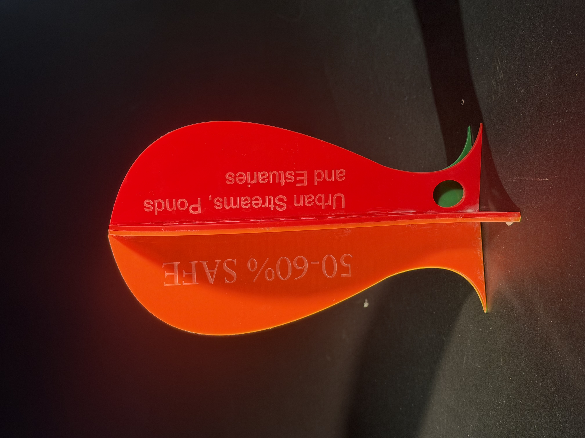
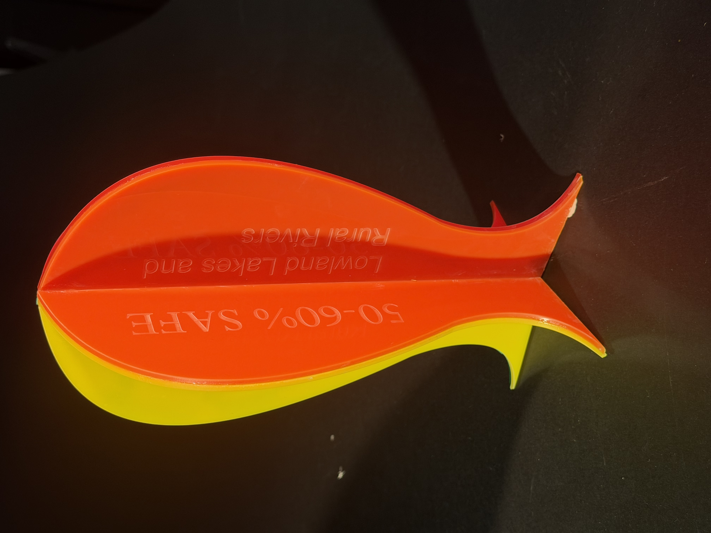
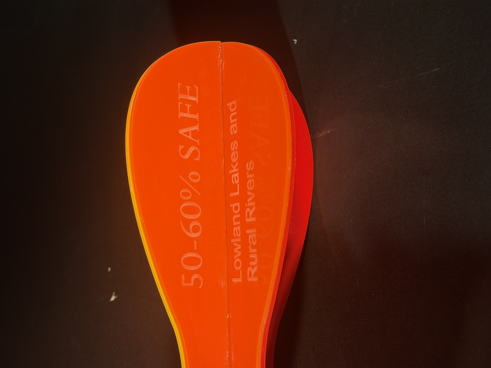

# Week 12

[← Back to Home](../index.md)

## Project Statement

# Safe Waters

This data visualisation explores water quality across different types of waterways in Aotearoa New Zealand. Using environmental data from national water quality reports and monitoring programmes, the project compares the relative safety of mountain lakes and alpine rivers, coastal marine areas, lowland lakes and rural rivers, and urban streams, ponds, and estuaries.

The project began with an interest in fish and aquatic ecosystems. This led me to consider the relationship between water quality, environmental health, and the places where people fish. Because fish depend on healthy waterways to survive, fishing became a useful context for communicating broader environmental issues. The visualisation takes the form of a physical fish-shaped artefact, using the familiar silhouette of a fish to immediately connect viewers to the subject matter.

The colour system is a key part of the design. Green represents the safest water conditions, gradually transitioning through yellow and orange to red as water quality decreases. This visual language was chosen because these colours are commonly associated with safety, caution, and danger, allowing viewers to quickly understand the information being presented.

The work also considers a future scenario in which water pollution and environmental degradation continue to affect waterways throughout Aotearoa. If these trends continue, safe fishing environments may become less common and aquatic ecosystems may face increasing pressure. By presenting environmental data in a physical and accessible form, the project encourages viewers to think about the long-term impacts of human activity on water systems.

Rather than displaying information through a traditional graph or screen-based visualisation, this project explores how data can be communicated through an object that provides both context and meaning. The intended impact is to increase awareness of water quality issues and encourage reflection on the importance of protecting freshwater and marine environments for future generations.

## Final Artifact

## Reflection 

Looking back on this project, I am pleased with how my proposal evolved from an initial idea into a more developed and meaningful outcome. Throughout the process, I explored different ways of communicating environmental data and experimented with sketches, research, 3D modelling, and prototyping methods to better understand my concept.

One of the biggest challenges was translating complex water quality information into a form that was engaging and easy to understand. Through research and feedback, I refined my approach and developed a physical fish-shaped artefact that provides context for the data while remaining visually accessible.

Although there were ideas and experiments that did not progress as planned, each stage helped me better understand the strengths and limitations of my project. Overall, this process strengthened my skills in research, visual communication, and iterative design, while reinforcing the importance of using design to make environmental issues more visible and understandable.
